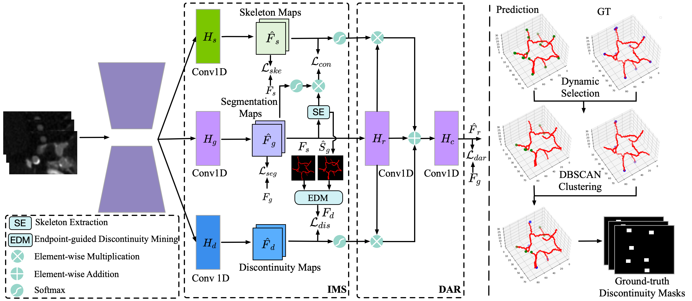

# GLCP: Global-to-Local Connectivity Preservation for Tubular Structure Segmentation
[](https://miccai.org/)

#### MICCAI 2025 Best Paper and Young Scientist Award Finalist (25/3677)!
#### This work is early accepted  (top 9%) by [MICCAI 2025](https://conferences.miccai.org/2025/en/default.asp)!
## Overview

This repository contains the code for **"GLCP: Global-to-Local Connectivity Preservation for Tubular Structure Segmentation"**! The propose GLCP can be integrated within the popular [nnUNet framework](https://github.com/MIC-DKFZ/nnUNet).



## Dataset
The method is validated on several public datasets, including:

- [**STARE**](https://cecas.clemson.edu/~ahoover/stare/): Retinal blood vessels (2D).
- [**TopCoW**](https://topcow23.grand-challenge.org/): Circle of Willis vessels in the brain (3D).


## Usage
### Installation

Please follow  the official [nnUNet V2](https://github.com/MIC-DKFZ/nnUNet).

### Training

for 2D:
```bash
nnUNetv2_train DATASET_NAME_OR_ID 2d FOLD -tr nnUNetTrainer_2DUnet_NoDeepSupervision_CE_DC_crit_ske_refine
```

for 3D:
```bash
nnUNetv2_train DATASET_NAME_OR_ID 3d_fullres FOLD -tr nnUNetTrainer_3DUnet_NoDeepSupervision_CE_DC_crit_ske_refine
```
## Results


## Citation
Please cite the following paper if you use this repository in your research.
```
@InProceedings{ZhoFei_GLCP_MICCAI2025,
        author = { Zhou, Feixiang AND Gao, Zhuangzhi AND Zhao, He AND Xie, Jianyang AND Meng, Yanda AND Zhao, Yitian AND Lip, Gregory Y. H. AND Zheng, Yalin},
        title = { { GLCP: Global-to-Local Connectivity Preservation for Tubular Structure Segmentation } },
        booktitle = {proceedings of Medical Image Computing and Computer Assisted Intervention -- MICCAI 2025},
        year = {2025},
        publisher = {Springer Nature Switzerland},
        volume = {LNCS 15975},
        month = {September},
        page = {237 -- 247}
}
```

## Contact
For any questions, feel free to contact: `feixiang.zhou.ai@gmail.com`
